Rất vui khi nhận được sự theo dõi của các bạn trong khóa học hướng dẫn lập trình C++ hướng thực hành.

Sau khi học xong bài [Biến và các kiểu dữ liệu](/1-cpp-co-ban/1-4-bien-va-cac-kieu-du-lieu-trong-cpp.md), các bạn đã có thể tự mình giải một số bài toán cơ bản trên máy tính. Lấy một ví dụ cơ bản như sau:

*Viết chương trình tính tổng giá trị hai số nguyên.*

Mình tin rằng tất cả chúng ta ai cũng viết được một chương trình như thế này:

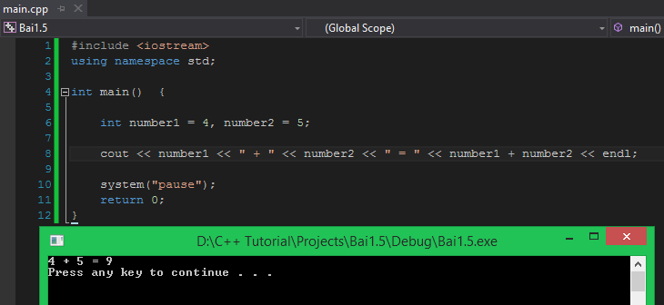

Các bạn có thể bắt gặp một cách khai báo biến hơi lạ.

```
int number1 = 4, number2 = 5;
```

Đây là cách khai báo các biến có cùng kiểu dữ liệu trên cùng một dòng đồng thời khởi tạo giá trị ban đầu cho mỗi biến. **Khi khai báo nhiều biến trên cùng 1 dòng, mỗi biến được khai báo sẽ cách nhau bằng 1 dấu phẩy.** Điều này hoàn toàn được cho phép trong C++.

Sau đó, chúng ta có sử dụng một lần đối tượng **cout** để in kết quả phép cộng ra màn hình:

```
cout << number1 << " + " << number2 << " = " << number1 + number2 << endl;
```

Để các bạn khỏi bị rối khi nhìn thấy dòng lệnh **cout** phức tạp, các bạn theo dõi hình bên dưới để rõ hơn:

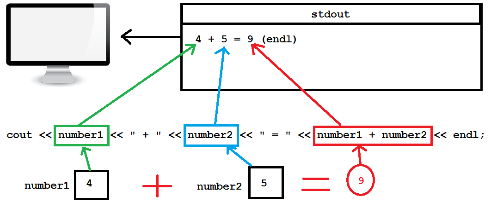

Sau khi chạy chương trình, chúng ta đã có được kết quả phép tính cộng ở trên màn hình. Bây giờ mình đặt ra trường hợp, mình muốn tính tổng của hai số nguyên có giá trị khác. Các bạn sẽ làm gì để giúp mình giải quyết vấn đề này? Có phải các bạn đang nghĩ tới việc tắt chương trình đang chạy đi, vào file **main.cpp**, thay hai số 4 và 5 thành hai con số khác, biên dịch và chạy lại chương trình một lần nữa?

Đó cũng là một cách giải quyết vấn đề mà vẫn cho kết quả đúng, nhưng có lẽ mình tự tính nhẩm trong đầu còn nhanh hơn.

Vì thế, ngôn ngữ C++ đã hổ trợ cho chúng ta một cách để đưa giá trị vào biến trực tiếp ngay khi chương trình đang chạy. Điều này giúp chúng ta linh động hơn khi cần thay đổi giá trị tính toán mà không cần phải build lại chương trình sau khi đã cho ra **file execute**.

Việc **Input data** như trên có thể thực hiện bằng nhiều cách khác nhau:

- Lấy dữ liệu từ **File**.
- Sinh dữ liệu ngẫu nhiên.
- Nhận dữ liệu từ thiết bị khác gửi đến.
- Nhập dữ liệu từ thiết bị nhập chuẩn. (Trong C++, thiết bị nhập dữ liệu chuẩn là bàn phím)

**Ở mức cơ bản này, chúng ta sẽ làm quen với cách nhập dữ liệu thông qua thiết bị nhập chuẩn (Standard Input) của C++.**

##Standard Input

Để đưa dữ liệu vào biến, chúng ta sử dụng đối tượng **cin** được định nghĩa bên trong thư viện **iostream** thuộc namespace **std**.

Cú pháp sử dụng đối tượng **cin** như sau:

```
cin >> <tên biến>;
```

Các bạn lưu ý là tên biến phải được khai báo trước khi sử dụng đối tượng **cin** để đưa giá trị vào biến đó. Ta sử dụng toán tử **>>** ngược chiều với toán tử được sử dụng cho từ khóa **cout**.

####Cách hoạt động đối tượng cin

Ngược lại với đối tượng **cout** (**cout** đưa dữ liệu vào file **stdout** để xuất giá trị ra thiết bị xuất chuẩn), đối tượng **cin** lấy dữ liệu từ đối tượng file **stdin** để đẩy vào vùng nhớ của biến (variable).

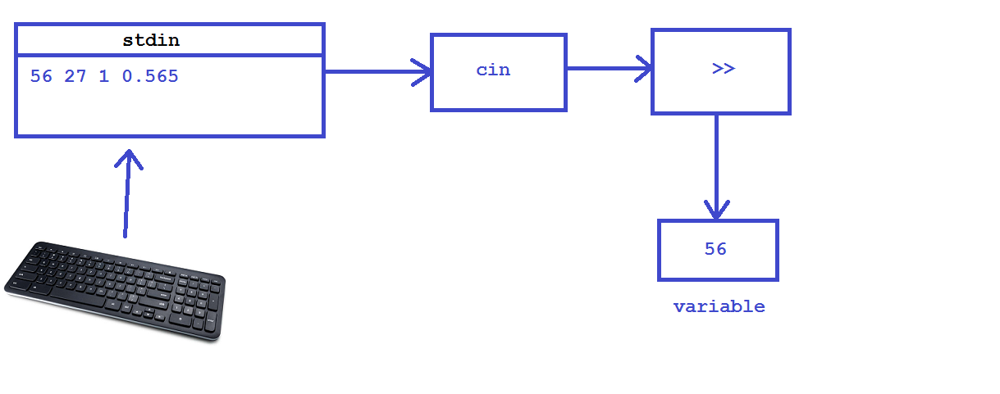

Khi biên dịch chương trình, nếu compiler bắt gặp dòng lệnh có sử dụng đối tượng **cin**, chương trình sẽ dừng lại để đợi người dùng nhập dữ liệu từ bàn phím (đến khi người dùng nhấn phím Enter), sau đó, dữ liệu vừa được nhập sẽ chuyển vào file **stdin**, đối tượng **cin** sẽ lấy giá trị đầu tiên **phù hợp với kiểu dữ liệu** để đưa vào biến thông qua toán tử **>>**.

Các bạn cùng mình chạy thử đoạn chương trình bên dưới để xem kết quả thực tế:

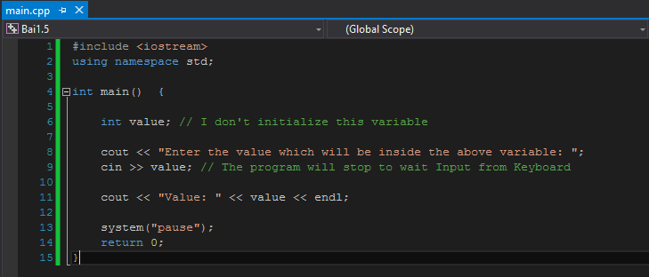

Chúng ta chạy thử chương trình trên, đầu tiên chúng ta thấy:

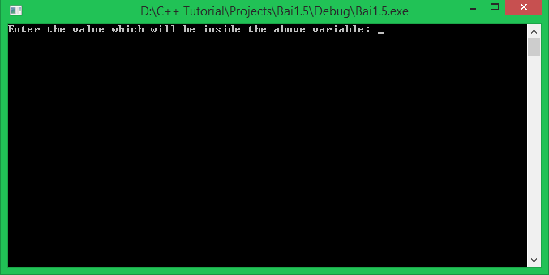

Sau khi chương trình thực thi dòng lệnh có sử dụng đối tượng **cout** đầu tiên, chương trình bắt gặp dòng lệnh có sử dụng đối tượng **cin**, ngay lúc này, chương trình dừng lại và đợi bạn nhập giá trị vào từ bàn phím.


Tiếp theo mình thử nhập vào giá trị **123**, giá trị này cũng nằm trong giới hạn của kiểu số nguyên (**int**) nên hoàn toàn phù hợp với biến **value**. Ngay sau khi mình nhấn phím Enter, biến **value** nhận giá trị **123** và in ra trên màn hình.

Bây giờ, khi chúng ta muốn thay đổi giá trị khác cho biến **value**, chúng ta không cần phải gán lại giá trị mới trong mã nguồn nữa, chúng ta chỉ cần chạy lại chương trình và nhập giá trị mới từ bàn phím.

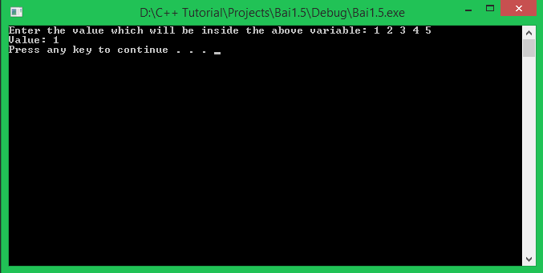

Mình vừa cố tình nhập một lúc 5 giá trị, mỗi giá trị cách nhau bởi một kí tự khoảng trắng. Và kết quả cho chúng ta thấy chỉ có giá trị đầu tiên mà chúng ta đưa vào được đẩy vào bên trong biến **value**.

Mình sẽ thử nhập một giá trị khác kiểu dữ liệu so với kiểu dữ liệu mà biến **value** được khai báo để xem kết quả:


Giá trị được nhập từ bàn phím là **3.14** là một giá trị thuộc kiểu số thực, nhưng kiểu dữ liệu chúng ta khai báo biến **value** là **int**, nên biến **value** chỉ chứa được phần nguyên của giá trị nhập vào, phần thập phân đã bị loại bỏ.

Cuối cùng, mình thử nhập giá trị không phải là kiểu số như bên dưới:

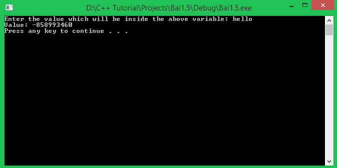

Chuỗi kí tự **hello** không phù hợp với kiểu số nguyên, nên biến **value** đã nhận giá trị sai.

Vì thế, các bạn cần nhập dữ liệu tương ứng với kiểu dữ liệu mà bạn đã khai báo cho biến.

####Nhập giá trị cho nhiều biến

Chúng ta cùng xem lại hình ảnh về cách hoạt động của đối tượng **cin**:


Chúng ta có thể nhập một lúc nhiều giá trị khác nhau để đưa vào file **stdin**. Ngay khi một giá trị được đưa vào biến thông qua đối tượng **cin**, giá trị đó sẽ bị xóa ra khỏi file **stdin** lần lượt từ trái sang phải.

Chúng ta có thể tận dụng đặc điểm này để nhập dữ liệu cùng một lúc cho nhiều biến mà không cần viết nhiều dòng lệnh sử dụng đối tượng **cin**.

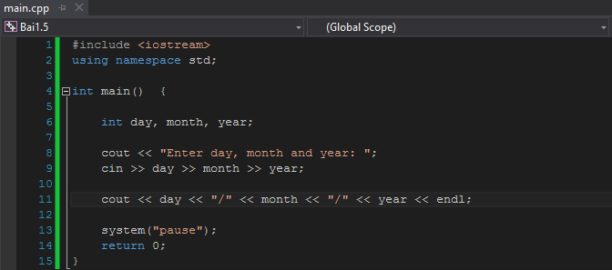

Trong chương trình trên, mình khai báo 3 biến có cùng kiểu dữ liệu số nguyên là **day**, **month** và **year** để lưu trữ ngày, tháng, năm hiện tại. Và mình chỉ sử dụng 1 dòng lệnh để nhập giá trị cho cả 3 biến trên:

```
cin >> day >> month >> year;
```

Đối tượng **cin** trên sẽ truy xuất đến file **stdin** và lấy giá trị đã được nhập vào từ trái sang phải để đưa vào theo tứ tự **day** đến **month** và cuối cùng là **year**.

Chúng ta cùng chạy chương trình để xem kết quả:

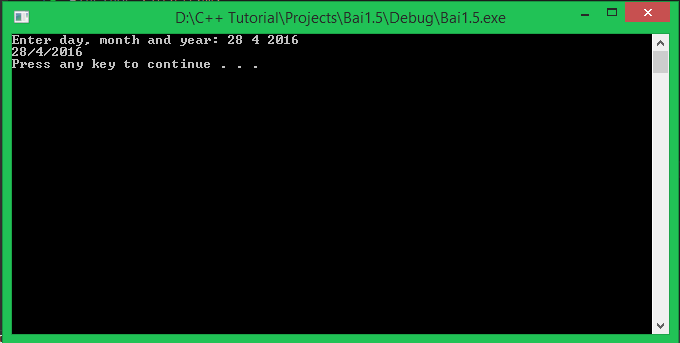

Các bạn hoàn toàn có thể nhập 3 giá trị trên 3 dòng khác nhau, lệnh **cin** vẫn khiến chương trình dừng cho đến khi nhận đủ 3 giá trị cho 3 biến day, month và year.

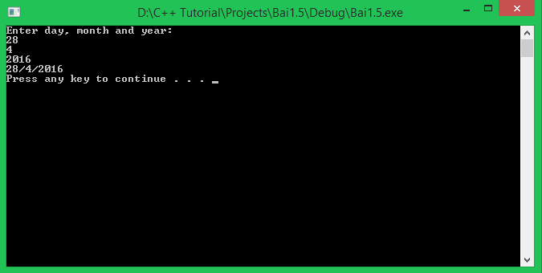

##Standard Output

Các bạn đã được học và sử dụng **stardard output** của C++ trong bài [Sử dụng các lệnh liên quan đến xuất dữ liệu](/1-cpp-co-ban/1-3-su-dung-cac-lenh-lien-quan-den-xuat-du-lieu.md). Trong C++, chúng ta sử dụng đối tượng **cout** được định nghĩa trong thư viện **iostream** thuộc **namespace std** để đưa dữ liệu ra thiết bị đầu ra (mặc định là màn hình).

Ngoài các cách xuất dữ liệu mà các bạn đã được học, chúng ta còn có thể đưa vào đối tượng **cout** một biến, và giá trị mà biến đó đang chứa sẽ được đối tượng **cout** đưa ra màn hình.

Cùng nhìn lại chương trình nhập vào ngày, tháng, năm từ bàn phím và in ngày, tháng, năm vừa nhập ra màn hình:


Sau dòng lệnh

 ```cin >> day >> month >> year;```

chúng ta có dòng lệnh 

```cout << day << "/" << month << "/" << year << endl;```

Các bạn cùng nhìn vào hình bên dưới để xem cách mà đối tượng **cout** trong dòng lệnh trên hoạt động:

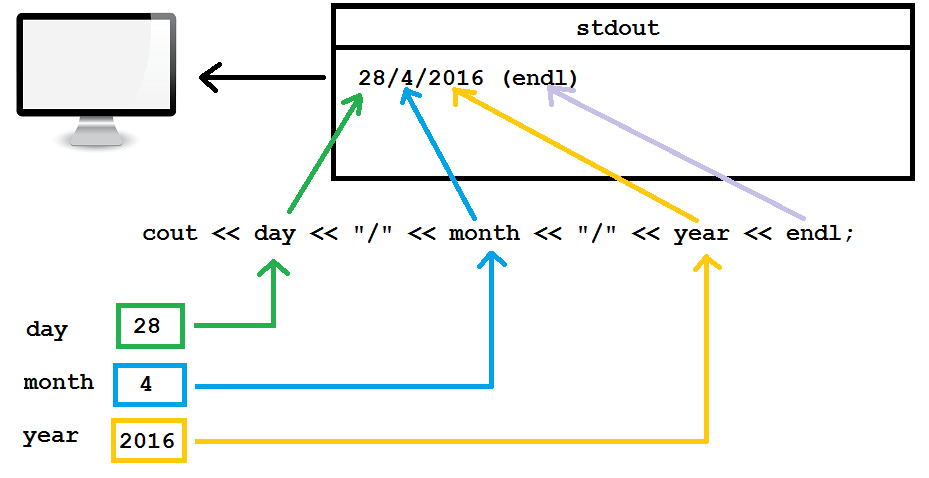

Đối tượng **cout** sẽ tìm đến ô nhớ mà tên biến đang nắm giữ, lấy giá trị bên trong biến đó ra và đẩy giá trị đó vào file **stdout**.

Đối tượng **cout** có thể nhận giá trị thuộc mọi kiểu dữ liệu được định nghĩa sẵn trong ngôn ngữ C++. Chúng ta không những sử dụng những dữ liệu được định nghĩa sẵn trong C++ mà còn tự định nghĩa những kiểu dữ liệu mới cho riêng mình. Các bạn sẽ được học phần này trong các bài học kế tiếp trong khóa học này.

##Tổng kết

Trong bài học này, các bạn đã được học về:

- Cách đưa giá trị vào một biến trong khi chương trình đang chạy bằng **Stardard Input** trong C++.
- Cú pháp và một số cách hoạt động của đối tượng **cin**.
- Ôn lại một chút về **Stardard output** trong C++.

##Bài tập cơ bản

1. Viết chương trình nhập vào điểm trung bình của ba môn học Toán, Lý và Hóa của bạn. In ra màn hình trung bình cộng điểm của ba môn học trên.

2. Các bạn chắc đã biết về phương trình bậc nhất 1 ẩn số:

```
ax + b = 0;
```

Các bạn hãy viết chương trình cho phép nhập từ bàn phím 2 giá trị a và b, tính nghiệm x của phương trình bậc nhất 1 ẩn số. Thử dự đoán vấn đề gặp phải với chương trình mà bạn vừa viết.


**Hẹn gặp lại các bạn trong bài học tiếp theo trong khóa học lập trình C++ hướng thực hành.**


Mọi ý kiến đóng góp hoặc thắc mắc có thể đặt câu hỏi trực tiếp tại diễn đàn 

**www.daynhauhoc.com**