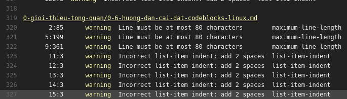

## Markdown

### Tất cả các bài viết đều phải dùng markdown

[Nếu bạn chưa biết cách sử dụng Markdown có thể tham khảo ở đây](https://guides.github.com/features/mastering-markdown/#examples)

### Quy tắc viết Markdown

Các bạn có thể sử dụng quy tắc của [GitHub Flavored Markdown (GFM)](https://guides.github.com/features/mastering-markdown/#GitHub-flavored-markdown)
hoặc là [Common Mark (CM)](http://commonmark.org/help/).

Thực chất thì GFM chỉ là chuẩn mở rộng của CM nên 2 chuẩn này
tương thích với nhau.

### Kiểm tra chất lượng Markdown

Tiêu chuẩn đề ra cho các file Markdown là:

  - Xem tốt trên website (tất nhiên)
  - Xem tốt trên Github
  - Coi mã nguồn mà vẫn đọc được nội dung

DNH dùng [remark-lint](https://github.com/wooorm/remark-lint) để tự động hóa
việc kiểm tra lỗi cho mỗi commit cũng như mỗi khi bạn gửi
Pull Request (PR) về cho DNH.

Nếu bạn gửi PR mà có lỗi, dưới đây là 2 cách bạn có thể kiểm tra lỗi:

#### Trên giao diện Github với Travis

Mỗi khi bạn gửi PR thì Travis sẽ tự động kiểm lỗi Markdown.
Nếu các file Markdown bạn chỉnh sửa bị lỗi thì bên dưới PR của bạn sẽ
có dạng thế này:

Bạn bấm vào <kbd>Details</kbd> để chuyển sang Github và xem theo báo cáo cụ thể

Hãy sửa theo hướng dẫn rồi tiếp tục gửi các commit đã sửa lỗi về cho DNH.

Khi giao diện của Github báo thế này là bài viết của bạn đã đạt yêu cầu
mà DNH đặt ra

#### Kiểm tra trực tiếp trên máy

### Các lỗi Markdown thường gặp

## Hình ảnh

(Hướng dẫn chèn hình ảnh)
